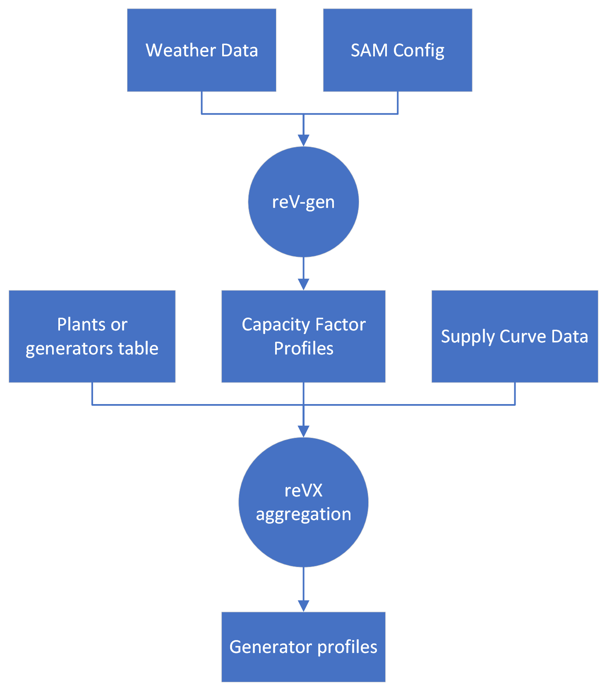

# reV-PowerSystems

[`reV`](https://github.com/NREL/reV) is an NREL tool to turn weather data and a set of
locations and technologies into a more realistic map of generation profiles.

To get reV data into PowerSystems.jl, you'll need
- A `cf_fpath` (capacity factor) HDF5 file from the output of `reV-gen`
- A `rev_sc` (reV supply curve) csv from the output of `reV.supply_curve`.
This must have the columns `sc_gid`, `latitude`, `longitude`, `res_gids`, `gid_counts`, `mean_cf`.
- A csv file containing `latitude`, `longitude`, `capacity` (in MW), and `component_name` (referencing your component in SIIP).

## reV Pipeline

 
## Our Pipeline (+ reVX aggregation)

Assuming you have already instantiated the Julia package and loaded the `environment.yaml` into `conda`,
we can load the data and run the pipeline using [`dvc`](https://github.com/iterative/dvc/):

1. `dvc update test/data -R` to load in reV output data
2. In the `test` directory, run `dvc repro`.

### Aggregating reV data with the right parameters.

We'll use `test/data/naris_rev_wtk_gen_colorado_2007.h5` for our `cf_fpath`
and `test/data/wtk_coe_2017_cem_v3_wind_conus_multiyear_colorado.csv` for the `rev_sc` file.

For our list of locations and components, we have `test/data/siip_meta.csv`.

1. In `test/siip_simple_plant_builder.py`, we use the `simple_plant_builder` in `reVX` to
generate `siip_example_simple_plant_builder_utc.h5`. Note that there is a mismatch between `out_fpath` and the filepath.

### reVX to time series CSV and time series pointer JSON.

2. In `test/test_no_lookahead.py`, we convert the reVX data into the appropriate CSV format with a time series pointer file for PowerSystems.jl.

### Load into PowerSystems.jl

3. In `test/create_basic_system.jl`, we load in the time series pointer file.

## Lookahead

Our solution for lookahead is
1. Generate multiple outputs using `reVX`'s `simple_plant_builder`.
2. Combine those HDF5 files into one CSV for each component forecast with a single time series pointer file (`test/test_lookahead.py`).
3. Load the lookahead data normally (`test/create_lookahead_sys.jl`
